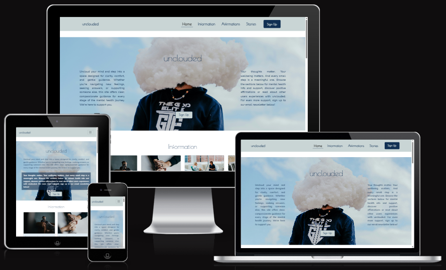
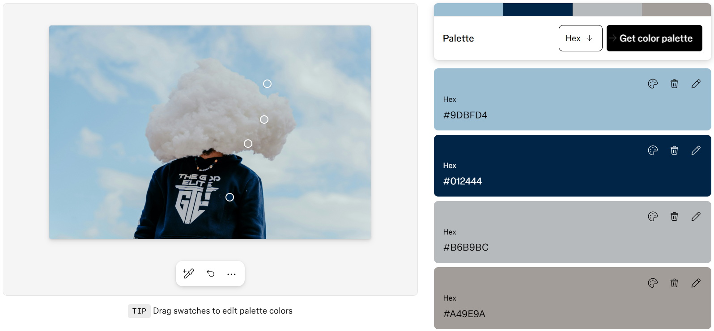
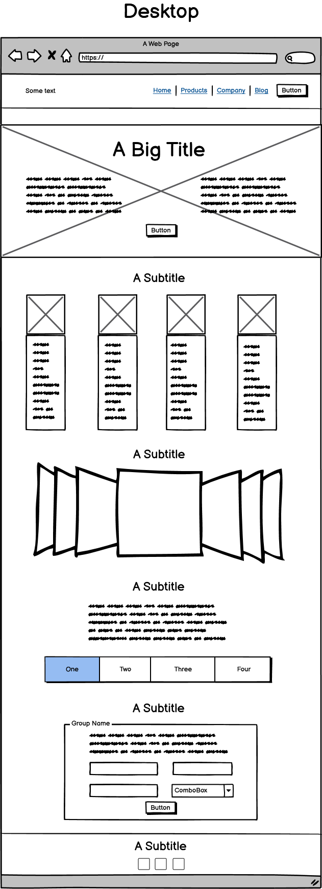
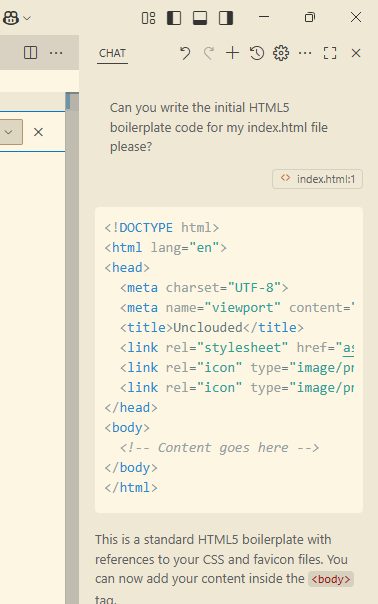
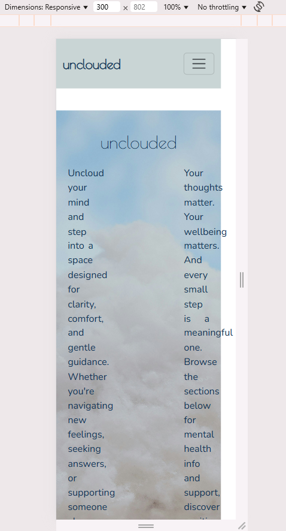
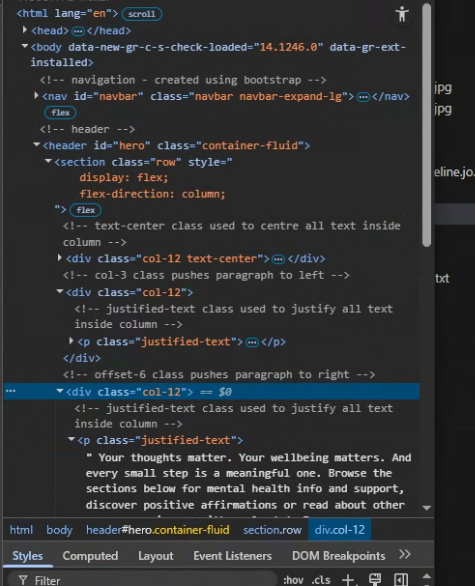
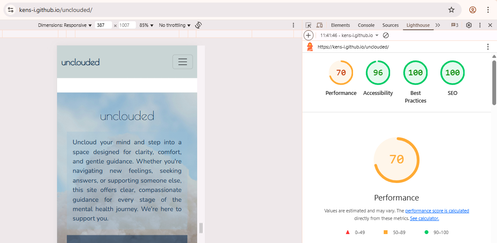

# ☁️ Unclouded | Mental Health Awareness | Individual Formative Assignment: HTML, CSS, Bootstrap

**🔗 Deployed Site:** [https://kens-i.github.io/unclouded/](https://kens-i.github.io/unclouded/)  
**👩🏻‍💻 Author:** Kensi Ranasinghe 
--- 

---

## ℹ️ Introduction

This project is a responsive one-page website designed to raise mental health awareness. It was built using HTML, CSS, Bootstrap, and Copilot. Developed from a user-centred brief, the site aims to deliver accessible, beginner-friendly information on mental health in a clean and supportive layout. The design focuses on positive messaging, clear navigation, and calming aesthetics—ensuring visitors feel welcomed and empowered. Key features include a hero section with uplifting messaging, information cards with practical tips, visually prominent external resource links, and a gentle space for affirmations—all crafted to support users seeking clarity, reassurance, and guidance.

---

## ✨ Features

**Current Features:**
- Navigation Bar with CTA Button  
- Hero Section with About Info & CTA Button  
- Information Section with External Resources  
- Affirmations Section  
- Stories Section of Testimonials with Modals  
- Form Section for Newsletter Subscription  
- Footer with Social Media Links  

**Originally Planned Features:**
- Stories Section of Testimonials with Dropdowns 

I was originally planning to have dropdown buttons for the stories section rather than modals. However, I was unsuccessful in getting the dropdowns to appear below the buttons rather than above, without throwing the rest of the structure of my website out. After a considerable amount of time trying to resolve this, and many failed attempts at Copilots recomended solutions, I decided to swap my original idea for Bootstraps Modal Components. I am actually very pleased with this outcome, it allowed me to challenge myself to play around with a different BS component that uses JavaScript and I actually think the modals work far better for the stories than drop downs would have. I believe they make the site more dynamic and interesting.

---

## 🗃️ Planning

**Project Board**

I used GitHub Projects to create a Project Board with all of my user stories. I used this throughout the project to stay on target and ensure I met the acceptance criteria of each story. To access the board and read the user stories please:

👉 [Click Here](https://github.com/users/kens-i/projects/7)

---

## 🛜 Deployment

**GitHub Pages**  

My site has been deployed using GitHub Pages as part of my minimal viable product approach. It has provided a fast, free, and reliable hosting solution, allowing me to concentrate on building out core functionality as I am yet to learn about backend infrastructure. Since it’s integrated directly with my repository, it enables simple updates and automatic version control. Using GitHub Pages from the outset has helped showcase early progress, collect valuable feedback, and begin validating my concept efficiently. 

Below is a link to my deployed site (this can also be found at the top of the README)

👉 [Visit Site](https://kens-i.github.io/unclouded/)

---

## 🎨 Design Choices

**Hero Image**

I based a lot of my design choices on my hero image (please see details in Image Credits section below). I originally thought of the name 'unclouded' and searched Unsplash for an image of a person with a cloud on their head- an out-of-the-box concept for sure, but to my surprise I did get one result that fit this brief perfectly. I therefore based all other design choices on this image and the name 'unclouded'.

👉 [Visit Site](https://unsplash.com/)

---

**Colors**

I used the figma color picker to select a colour palette directly from my chosen hero image. This allowed me to tie everything into this central visual element, creating a cohesive and visually harmonious design throughout the site. By extracting colours directly from the hero image, I ensured that every component — from typography to buttons — feels naturally aligned and stylistically unified.

👉 [Visit Site](https://figma.com/color-picker/)

I also used a contrast checker to ensure the colours work well together and are accessible. This ensures that all users, regardless of visual ability or device type, can comfortably engage with the content. It reinforces the importance of inclusive design while maintai

👉 [Visit Site](https://webaim.org/resources/contrastchecker/)

---

**Typography**

To reinforce the calming and clear ethos behind the name 'unclouded', I carefully selected Poiret One and Nunito from Google Fonts to complement the calm, supportive tone of a mental health awareness website. Poiret One brings a light, airy elegance that pairs beautifully with the brand name, adding a sense of openness and simplicity. Nunito, with its rounded forms and balanced readability, anchors the design with warmth and approachability. Together, they reinforce a feeling of clarity and comfort, creating a typography system that’s both distinctive and serene.

👉 [Visit Site](https://fonts.google.com/)

 

---

## 🖥️ Wireframes

**Desktop**

 

---

**Full Range of Screen Sizes (Desktops, Tablets and Mobiles)**

[Download Wireframes](assets/wireframes/unclouded-wireframes.pdf)

---

## ⚙️ Technologies

**Languages:**
- HTML
- CSS
- Markdown

---

**Other Technologies**
- Bootstrap 5
- Google Fonts
- Font Awesome
- Visual Studio Code
- Git
- GitHub
- GitHub Pages
- GitHub Projects
- Copilot
- Chrome DevTools

--- 

## 👽 AI

**Coding Creation**

Using Copilot chat in VS Code was helpful when writing my initial HTML5 boilerplate code. Instead of starting from a blank file, I simply asked for the standard structure of an HTML document, and Copilot generated it instantly — referencing my CSS and favicon files.

 

---

**Debugging**

Copilot was my go-to debugging partner throughout the entire project, especially when wrangling Bootstrap’s grid system and customizing its styles. Anytime I hit a wall—like misaligned columns or conflicting class behaviors — I turned to Copilot. It helped me understand how Bootstrap’s container, row, and column classes worked together and even offered clear examples of how to structure my layout properly. When I needed to override Bootstrap’s default styles, Copilot suggested using more specific CSS selectors or the !important rule, explaining the pros and cons along the way. It felt like having a knowledgeable developer on call, guiding me through each tweak with precision and patience.

---

**Optimize Code**

When it came to optimizing my code, Copilot became an indispensable sidekick. I’d frequently share snippets of my work either in Copilot in browser or directly in the editor, using inline chat to point out areas I suspected could be cleaner or more efficient. Whether I was refining my HTML structure or trimming redundant CSS rules, Copilot offered smart suggestions. It was about elevating my code to a more professional level. With Copilot, I had a collaborative coding experience that helped me sharpen my skills while building a faster, cleaner project.

---

**Impact**

AI had a great impact on my project — from writing clean HTML to debugging Bootstrap layouts and fine-tuning performance. Using Copilot in VS Code helped me solve issues quickly, optimize my code, and learn as I built. It felt like coding with a helpful teammate who never sleeps. The whole process became faster, smarter, and way more enjoyable.

---

## 🛠️Testing & Debugging

**Debugging With AI**

Please see AI section above for information on how I used AI to debug issues throughout my project.

---

**Debugging with DevTools and Support from Coding Coach**

I encountered a challenge with Bootstrap’s grid system when trying to stack two justified paragraphs on smaller screens. On larger devices, the layout appeared as intended, but as the screen size reduced, the paragraphs would either: overlap awkwardly or be expanded out of the section, breaking the clean structure I was aiming for. I turned to Chrome DevTools to inspect how each column behaved at different breakpoints, identifying where my Bootstrap’s column classes were causing misalignment. With some trial and error in real time, I adjusted the grid system column classes to fine-tune the responsiveness. I sought guidance from our Coding Coach, who helped me understand the grid system and which classes to use. I also asked Copilot for guidance while playing around with the classes to get the alignment how I wanted.

 

---

**HTML and CSS Validators**

I used the W3 HTML and CC Validators to review my code for any issues. They initially detected a few errors, which I was able to resolve quickly thanks to their clear guidance. After making the necessary corrections, I revalidated the code and confirmed that no errors remained.

👉 [Visit Site](https://validator.w3.org/)
👉 [Visit Site](https://jigsaw.w3.org/css-validator/)

---

**LightHouse**

I used Chrome DevTools' Lighthouse tool to evaluate my website's performance, accessibility, best practices, and SEO. Running the audit gave me a comprehensive report highlighting areas for improvement, such as images. However, I was unable to implement changes at this time to improve the Hero Image for performance. This is something I plan to do for the future to improve the performance of the site.

## 🙌🏻 Acknowledgments

**Stock Photos** 

Hero Image 👉 [Visit Site](https://unsplash.com/photos/a-person-with-a-cloud-on-their-head-tZH8xyGGMHE?utm_content=creditShareLink&utm_medium=referral&utm_source=unsplash)

First Info 👉 [Visit Site](https://unsplash.com/photos/a-man-holds-his-head-while-sitting-on-a-sofa-BuNWp1bL0nc?utm_content=creditShareLink&utm_medium=referral&utm_source=unsplash)

Second Info 👉 [Visit Site](https://unsplash.com/photos/person-in-black-long-sleeve-shirt-holding-babys-feet-aPa843frIzI?utm_content=creditShareLink&utm_medium=referral&utm_source=unsplash)

Third Info 👉 [Visit Site](https://unsplash.com/photos/two-woman-sits-on-sofa-chairs-inside-house-4xe-yVFJCvw?utm_content=creditShareLink&utm_medium=referral&utm_source=unsplash)

Fourth Info 👉 [Visit Site](https://unsplash.com/photos/person-using-macbook-hBuwVLcYTnA?utm_content=creditShareLink&utm_medium=referral&utm_source=unsplash)

---

**Academic Support**

**Facilitators & Tutors** - A big thank you to Marko Tot, Mark Briscoe and Roman Rakic for their support during this project. Their insights, encouragement, and timely feedback helped me overcome key challenges and truly elevate the final outcome.

**Code Institute Team** - I would also like to thank Jo Heyndels and the rest of the Learning Content Development team for developing the learning materials and Walkthrough Projects that guided me through the intricacies of learning HTML, CSS, Bootstrap and other methodologies used in this project. It helped me gain the confidence to apply key coding concepts in practical, real-world scenarios and I was able to use the Walkthrough Projects as inspiration and starting-points for this project.

 